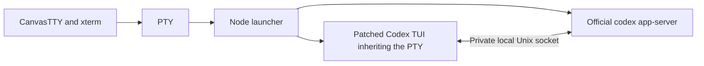

# macOS native editing proposal

This proposal lets macOS users edit a Codex draft with the usual Command keys
without assigning unrelated terminal keys to canvas actions.

## Keyboard and clipboard behavior

When a terminal or editable field has focus, its native keyboard handler receives
keys such as F2 and Home. F2 can therefore open the CLI's error report without
also renaming the canvas window. Existing canvas shortcuts still work when the
canvas has focus. This focus rule applies on macOS only.

- Command+C copies an xterm output selection. With no output selection in a
  Codex terminal, it sends Super+C to the draft editor.
- Command+V pastes text through xterm's bracketed-paste support. An image in the
  native clipboard instead sends Control+V so a CLI supporting image paste can
  read it. An asynchronous clipboard read is discarded if its terminal was
  closed, exited or restarted before the read completed.
- Command+A sends Super+A to the Codex draft editor. It selects the whole draft
  with the optional frontend below, including lines outside the viewport; it
  does not select terminal scrollback.
- Codex Enter, Shift+Enter and Command+Enter retain distinct terminal events.
  With the optional frontend, Enter and Shift+Enter add a newline to the draft;
  only Command+Enter submits (or queues during a running turn). This also applies
  to the provisional startup draft. Enter still confirms trust, resume and other
  dialogs, and embedded question editors retain their existing keys.
- Command+A in ordinary application inputs, textareas and contenteditable fields
  keeps native field selection. Physical key codes also support non-Latin
  keyboard layouts.
- Alt+arrow reaches focused terminal surfaces and editable fields on every OS;
  canvas focus navigation handles it only outside those input surfaces.
- Codex Enter events preserve Shift, Alt, Ctrl, and Super combinations through
  CSI-u on every OS. Plain Enter stays a carriage return. Submission and newline
  behavior belong to the CLI and its keymap; this bridge does not require an
  exact Codex version.
- Control+Shift+F still searches terminal output on macOS, and Control+D still
  restarts an exited terminal. Shift+Enter remains distinct for other CLIs.

## Optional Codex frontend

The local Linux adaptation and manual launch instructions are documented in
[linux-native-editing.md](linux-native-editing.md). It uses the same POSIX launcher
with a Linux-enabled frontend and Ctrl-based draft editing keys.

**Stock Codex 0.159.2 does not implement whole-draft selection.** The renderer
bridge alone cannot provide it. The demonstrated implementation is a separate
[Codex TUI frontend](https://github.com/mrcertis/codex-macos-tui/tree/f532966e68688bda6816ea2b6ae2bf921a5f53f5/macos)
based on official Codex `rust-v0.159.2`. Its launcher requires official
`codex-cli 0.159.2` as the backend and refuses other backend versions.

CanvasTTY continues resolving the official CLI from its existing provider
registry. An optional macOS bundle can include these resources:

```text
Contents/Resources/codex-native-tui/
  canvastty-codex-tui
  codex-tui-launch.mjs
  LICENSE
```

Both frontend and launcher must be present; a partial bundle gives an explicit
launch error. With neither resource present, the usual CLI launch is used. The
standard build does not download or include the external frontend automatically.
The [build and packaging recipe](https://github.com/mrcertis/codex-macos-tui/blob/f532966e68688bda6816ea2b6ae2bf921a5f53f5/macos/README.md#canvastty-170-integration)
uses adjacent CanvasTTY and Codex checkouts. On this branch, skip its `git apply`
steps because the integration is already applied. The recipe has been exercised
on Apple Silicon; Intel packaging remains unverified.

For local development, `CANVASTTY_CODEX_TUI_QA` and
`CANVASTTY_CODEX_TUI_LAUNCHER_QA` accept absolute frontend and launcher paths on
macOS. The launcher owns a private local app-server process and cleans up that
process on exit. It preserves interactive approval, sandbox, config and resume
flags. It rejects positional initial prompts and CLI image arguments; image
paste remains interactive. It does not replace the installed official CLI or
change global Codex configuration. Porting to another backend version requires
updating and testing the frontend and launcher together.

The optional frontend's selection and launcher tests live in its linked
repository. A maintainer decision on distribution and ongoing version support
is needed before including that frontend in official CanvasTTY releases.

## Process and input ownership

CanvasTTY supplies Electron window chrome, xterm rendering and a PTY. The CLI
owns the editable draft, completion state, selection and submission decisions.
Sending Super+A cannot create a select-all action that is missing in the CLI.

Ordinary launches run the resolved official `codex` executable, which manages
its own TUI/backend connection. The optional native-TUI bundle instead starts a Node
launcher inside the PTY. The launcher starts two child processes:



The frontend is a fork of Codex's Rust TUI, not a CanvasTTY editor. Its changes
add whole-draft selection, expansion of large pasted payloads when copying, and
the main-draft Enter policy, including startup and completion handling. These
changes do not modify the upstream keymap parser: the fork handles Super keys
directly in the composer. The launcher also translates CLI/resume flags and
owns backend cleanup, so this integration is more than a keyboard bridge.

Its client uses the upstream app-server protocol with experimental API enabled.
The exact `0.159.2` check is a restriction of this external launcher; it is not
the minimum version needed to fix CanvasTTY's keyboard ownership. Upstream's
remote TUI has a server-version notice path, rather than this launcher's exact
version gate. That does not establish compatibility of this fork with a newer
backend. The Alt+arrow and modified-Enter bridge changes work independently of
this optional bundle.

Source references: [frontend entry point](https://github.com/mrcertis/codex-macos-tui/blob/f532966e68688bda6816ea2b6ae2bf921a5f53f5/codex-rs/tui/src/canvastty_main.rs),
[launcher and version check](https://github.com/mrcertis/codex-macos-tui/blob/f532966e68688bda6816ea2b6ae2bf921a5f53f5/macos/codex-tui-launch.mjs),
and [upstream server-version notice](https://github.com/openai/codex/blob/rust-v0.159.2/codex-rs/tui/src/app/startup.rs#L282).

## Launch-scoped browser configuration

Codex launches carrying inline config use `--no-daemon` so each launch receives
its own browser capability rather than reusing a daemon's earlier configuration.
A successfully spawned PTY retains its unused browser capability while the user
is in a trust dialog or resume picker. Exit, close and failed-spawn cleanup still
revoke the capability; standalone unused capabilities keep their existing TTL.
Identity, one-time token use and reconnection checks remain in place.

## Regression checks

```sh
node --test tests/terminal-shortcuts.test.mjs tests/app-shortcuts.test.mjs \
  tests/canvas-navigation-override.test.mjs tests/terminal-lifecycle.test.mjs \
  tests/terminal-launch.test.mjs tests/orchestration-launch-role.test.mjs \
  tests/agent-browser-protocol-gateway.test.mjs
npm test
npm run test:even
npm run typecheck
npm run build
npm run audit:secrets
```

The checks cover modifier/layout routing, clipboard reads across session
changes, bundle resolution and delayed browser handshakes. Complete draft
selection also needs verification in the separately built frontend. GUI checks
should type and edit drafts without submitting them.
